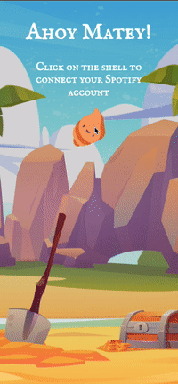
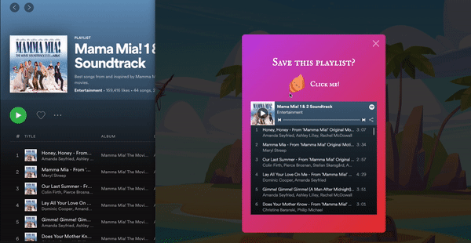

# Message in a Bottle

A full stack web application for nostalgic people who want to share their memories with others.

Sometimes scrolling through your camera roll, reading old notes, or listening to certain songs spark a wave of nostalgia for certain memories, so I created this app to help collect those mementos all in one place to share with others.

## Live Demo

Try the application live at [https://message-in-a-bottle-for-mateys.herokuapp.com/](https://message-in-a-bottle-for-mateys.herokuapp.com/)

## Technologies Used

- React.js
- Webpack
- Materialize
- Node.js
- Express
- React Router DOM
- AWS S3
- SendGrid
- PostgreSQL
- HTML5
- CSS3
- Heroku

## Features

- User can connect their Spotify account.
- User can create a message in a bottle.
- User can add songs and a playlist from Spotufy to their message.
- User can view the message they made.
- User can send the message to someone and the recipient gets an email with a link to it.
- User can open a message sent to them.
- User can save a playlist from a message to their Spotify account.
- User can save a playlist from a message to their Spotify account.

## Preview
Note: Message in a Bottle uses Spotify's Web API in development mode, so users must be registered in order to use the application. If you would like to use Message in a Bottle, please send me an email with your full name and the email your Spotify account is under at jamie.cafirma@gmail.com to be registered and use Message in a Bottle.

Connect Spotify account and create a message:



Save a playlist from a message to your Spotify account:



## Development

### System Requirements

- Node.js 10 or higher
- NPM 6 or higher
- React Router DOM 6 or higher

### Getting Started

1. Register an application at the [Spotify Developer website](https://developer.spotify.com/dashboard/login) to get a Spotify Client ID.

2. On your app's overview page, click on Edit Settings and add two Redirect URIs: http://localhost:3000/callback/sender and
http://localhost:3000/callback/recipient . Click [here](https://developer.spotify.com/documentation/general/guides/authorization/app-settings/) for Spotify's official guide.

3. Sign up at [SendGrid](https://signup.sendgrid.com/) to get the SendGrid API key.

4. Create an AWS account [here](https://aws.amazon.com/free/?all-free-tier.sort-by=item.additionalFields.SortRank&all-free-tier.sort-order=asc&awsf.Free%20Tier%20Types=*all&awsf.Free%20Tier%20Categories=*all), create an IAM user for S3 [here](https://console.aws.amazon.com/iam/home), then create an S3 bucket for your uploads. **You will be shown an access key id and a secret access key when you create an IAM user. You need to copy these to someplace safe where they can't be seen by anybody.**

5. Clone the repository.

    ```shell
    git clone https://github.com/jamiecafirma/message-in-a-bottle.git
    cd message-in-a-bottle
    ```

6. Install all dependencies with NPM.

    ```shell
    npm install
    ```

7. Create a PostgreSQL database for the app.

8. In .env.example, plug in all the corresponding values for each environment variable.

9. Make a copy of the provided .env.example file. Name your copy .env.

    ```shell
    cp .env.example .env
    ```

10. Import the database schema and test data using the provided "db:import" script in package.json.

    ```shell
    npm run db:import
    ```

11. Examine your database with the pgweb GUI tool for PostgreSQL.

    ```shell
    pgweb --db=yourDatabase
    ```

12. Start the project. Once started you can view the application by opening http://localhost:3000 in your browser.

    ```shell
    npm run dev
    ```

## Future Development

- User can edit a message.
- User can delete a message.
- User can play music within the app.
